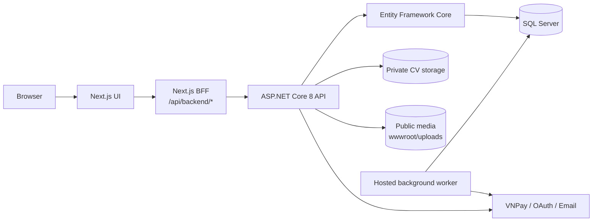
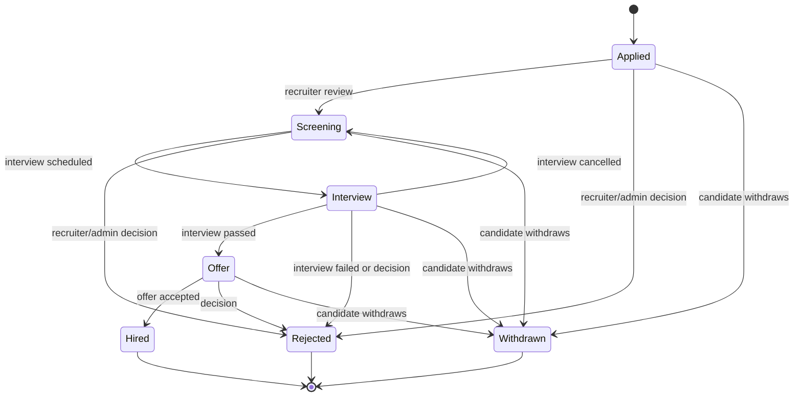

# JobPortal

### Recruitment and Applicant Tracking Platform

JobPortal is a recruitment platform for candidates, recruiters, and administrators. It covers the complete path from job publishing and candidate applications to interviews, offers, hiring decisions, payments, credit entitlements, notifications, and operational reporting.

The canonical runtime path is:

```text
Browser → Next.js → Next.js BFF → ASP.NET Core 8 → EF Core → SQL Server
```

The backend is a layered ASP.NET Core application with modular business service areas and one deployable process. It is intentionally documented as a modular monolith, not as a microservices system. The older NestJS/PostgreSQL implementation is retained as legacy/reference material; it is not the canonical runtime and does not receive new features.

> Documentation scope: this README describes the current source and verified local behavior. It does not imply production readiness, exactly-once delivery, antivirus scanning, or verified OAuth credentials.

## Canonical Architecture



## Overview

JobPortal solves a practical recruitment workflow problem: candidates need to discover suitable opportunities, maintain a profile, submit applications, and follow their progress; recruiters need controlled job publishing, applicant review, interviews, and candidate matching; administrators need moderation, verification, payment, and audit capabilities.

The implementation keeps important business decisions on the server. Application status transitions, interview scheduling, credit consumption, payment confirmation, entitlement granting, authorization, and concurrency checks are enforced by ASP.NET Core services rather than trusted to the browser.

## Why This Project

- Models recruitment as explicit state machines instead of unrestricted status updates.
- Protects concurrent edits with SQL Server `rowversion` values exposed as HTTP `ETag` headers and checked with `If-Match`.
- Writes business history, audit records, and outbox messages in the same database unit of work as the triggering mutation.
- Treats the verified VNPay IPN as the payment source of truth; the browser return page does not grant credits.
- Uses an append-only credit ledger with idempotency keys and balance invariants.
- Stores CVs outside `wwwroot` and checks authorization before returning the file.
- Uses server-side paging, filtering, batch loading, and `AsNoTracking` for high-volume read paths.

## Key Features

### Candidate

- Registration, password login, OAuth entry points, password change, and password reset.
- Profile, skills, certificates, education, experience, preferences, and private CV upload.
- Public job and company browsing, categories, blog, reviews, and saved jobs.
- Application submission, status tracking, withdrawal, interview participation, and notifications.
- Explainable job matching with a deterministic rule-based score.
- VNPay plan checkout and credit balance consumption.

### Recruiter

- Company profile and verification-aware management.
- Job draft, approval, activation, closing, and expiration workflow.
- Credit-based job creation and applicant review.
- Candidate search, authorized CV access, application status changes, and reports.
- Interview scheduling, rescheduling, completion, cancellation, result handling, and overlap checks.
- Candidate ranking through the matching service.

### Administrator

- User, company, job, application, interview, blog, and report moderation.
- Company verification and controlled administrative workflow overrides.
- Plan, payment-order, refund, and credit-adjustment operations.
- Audit review and operational dashboard/reporting endpoints.

## Engineering Highlights

1. **Recruitment workflow:** `Applied`, `Screening`, `Interview`, `Offer`, `Hired`, `Rejected`, and `Withdrawn` transitions are validated by role and current state.
2. **Optimistic concurrency:** `rowversion` values are encoded as ETags; missing `If-Match` returns `428`, and a stale version returns `409`.
3. **Transactional outbox:** application, interview, and other mutations enqueue durable messages for notifications and email processing.
4. **Reliable payment binding:** VNPay IPN validation binds the provider transaction to the local order, snapshot amount, currency, merchant, and transaction reference.
5. **Credit accounting:** grants, debits, refunds, and adjustments are represented as append-only ledger entries with idempotency protection.
6. **Entitlement snapshots:** payment orders preserve plan name, price, credit type, quantity, and expiry configuration at checkout time.
7. **Private CV handling:** CVs use GUID-based PDF names in private storage, with ownership checks, size/signature validation, and path traversal protection.
8. **Scalable reads:** company, report, and matching endpoints use server-side paging or batch-oriented queries instead of loading unbounded result sets.

## Technology Stack

| Area | Technology |
| --- | --- |
| Frontend | Next.js 15, React 19, TypeScript, NextAuth, Axios, next-intl, Tailwind CSS |
| Backend | C#, ASP.NET Core 8 Web API, controllers, hosted background service |
| Persistence | Entity Framework Core, SQL Server, explicit migrations |
| API documentation | Swagger/OpenAPI via Swashbuckle |
| Authentication | JWT Bearer, BCrypt password hashing, role and ownership checks |
| Payments | VNPay sandbox integration with signed server-side IPN handling |
| External identity | Google, Facebook, and GitHub OAuth entry points |
| Operations | Docker Compose, GitHub Actions, correlation IDs, audit logs, outbox processing |
| Testing | xUnit/WebApplicationFactory, frontend build/lint, OpenAPI contract checks |

### Legacy Reference Implementation

The repository history contains a NestJS/Prisma/PostgreSQL implementation for reference. The current product path is the Next.js BFF to ASP.NET Core 8 to SQL Server path described above.

## Business Workflow



Recruiters use the normal transition matrix. An administrator can override a status when required, but the override requires a reason and is audited.

Job posts use a separate lifecycle: `Draft`, `PendingApproval`, `Active`, `Closed`, `Expired`, and `Rejected`. Public job browsing exposes active, non-expired jobs only.

## Security Highlights

- A global authorization fallback policy requires authentication unless an endpoint explicitly allows anonymous access.
- JWT claims carry user identity and role. A password-version claim is checked against the database so password changes invalidate older tokens.
- Login has configurable failed-attempt tracking and temporary lockout.
- Password-reset links are random raw tokens delivered to the user while only SHA-256 token hashes are stored.
- Controllers enforce role permissions and resource ownership for applications, interviews, reports, payments, and CVs.
- Authentication and payment endpoints have fixed-window rate limits.
- Correlation IDs are propagated through requests and outbox messages; sensitive audit fields are sanitized and truncated.
- Private CVs are not served from `wwwroot`; direct `/uploads/cv` access is blocked.
- Public logos and blog media use a separate validation path from private CV files.

OAuth provider verification is implemented in the backend, but runtime verification requires real provider credentials and was not claimed as complete in the local verification pass. The CV path does not claim antivirus scanning; validation covers PDF extension, size, magic header, safe filename resolution, and authorization.

## Data Integrity and Concurrency

The EF Core model includes filtered query indexes, unique constraints, foreign-key rules, and concurrency tokens for critical resources. Examples include:

- Unique user email, OAuth provider/account pairs, candidate-job applications, payment references, and active notification source/message pairs.
- Restrictive foreign keys where deletion could break financial or audit history.
- Job, company, interview, job-report, and application-related `rowversion` protection.
- Indexed application history, interview overlap lookup, outbox processing, audit queries, ledger expiry, and report status.
- Serializable transactions for job creation plus credit debit, interview scheduling/completion/cancellation, payment confirmation plus entitlement grants, and other coupled mutations.

The application mutation path records the current entity change, status history, audit entry, and outbox message before committing. There is no distributed transaction between SQL Server and an external email or payment provider.

## Explainable Job Matching

Matching is a deterministic rule-based algorithm, not AI or machine learning. Version `v1` calculates a maximum score of 100:

| Component | Maximum |
| --- | ---: |
| Required-skill overlap | 60 |
| Experience | 20 |
| Education | 10 |
| Preferences | 10 |

The engine normalizes common aliases such as JavaScript/JS, React/ReactJS, C#/CSharp, .NET/Dotnet, PostgreSQL/Postgres, and SQL Server/MSSQL. Results include matched and missing skills, reason text, algorithm version, and a SHA-256 input fingerprint for reproducibility.

## Performance Considerations

The implementation uses database-side `Count`, filtering, ordering, `Skip`/`Take`, `AsNoTracking`, and batch loading where appropriate. The following are local benchmark observations, not production SLAs:

| Scenario | Observed samples (ms) | HTTP result |
| --- | --- | --- |
| Matching, 7 jobs | 196, 46, 17, 16, 12, 14 | 200; 7 items |
| Matching, 1,007 jobs | 559, 271, 170, 122, 117, 103 | 200; 100 items of 1,007 |
| Report query, 1,000 synthetic records | 1,515, 19, 17, 17, 28, 17 | 200; 100 items of 1,000 |

The first sample includes warm-up/JIT/connection effects. No before/after baseline was captured, so these numbers must not be presented as a percentage improvement or a production capacity guarantee.

## Testing and Verification

The latest local verification pass produced the following results:

| Check | Result |
| --- | --- |
| Backend Release build | Pass; 0 errors, 176 warnings |
| Backend tests | Pass; 10/10 |
| EF Core database update | Pass; no migrations pending |
| Frontend production build | Pass; 87 pages generated |
| Frontend lint | Pass with existing warnings |
| OpenAPI contract check | Pass; 39 paths, 38 schemas |
| Docker Compose configuration | Static configuration validated; Docker runtime unavailable during verification |

GitHub Actions is configured in `.github/workflows/ci.yml`. At the time of this documentation pass, the latest backend run failed during `dotnet build`; therefore this README intentionally has no green CI badge. The run had no uploaded artifacts. See the [latest backend workflow run](https://github.com/hataba123/JobPortalApi/actions/runs/34473238037) for the current external status.

## Local Development

### Option 1: Run the backend and frontend locally

Requirements: .NET 8 SDK, Node.js/npm, and SQL Server.

```powershell
dotnet restore

$env:ConnectionStrings__DefaultConnection = "<local SQL Server connection string>"
$env:Jwt__Key = "<random local secret of at least 32 characters>"
$env:Jwt__Issuer = "JobPortal"
$env:Jwt__Audience = "JobPortalClient"

dotnet ef database update --project .\JobPortalApi --startup-project .\JobPortalApi
dotnet run --project .\JobPortalApi --launch-profile http
```

The HTTP launch profile uses `http://localhost:5042`; Swagger is available at `/swagger`.

In the frontend repository:

```powershell
npm ci
Copy-Item .env.example .env.local
# Set BACKEND_API_URL and other local values in .env.local.
npm run dev
```

Never commit real passwords, JWT keys, OAuth secrets, VNPay secrets, or NextAuth secrets. Use environment variables or the existing local secret mechanism.

### Option 2: Docker Compose

From this repository, create a local `.env` from `.env.example`, replace every placeholder with local values, and run:

```powershell
Copy-Item .env.example .env
docker compose up --build
```

The Compose topology contains `sqlserver`, `aspnet-api`, and `frontend`. The API is exposed on port `8080`, the frontend on port `3000`, and named volumes persist SQL Server data and private CV data. Docker configuration was statically validated; an end-to-end Docker start, health check, and persistence run was not verified because the Docker daemon was unavailable during the verification pass.

## Database Migrations

Create and review migrations through the existing EF Core project, then apply them explicitly in the target environment:

```powershell
dotnet ef migrations add <MigrationName> --project .\JobPortalApi --startup-project .\JobPortalApi
dotnet ef database update --project .\JobPortalApi --startup-project .\JobPortalApi
```

Review generated SQL and migration contents before deployment. The application does not silently replace an explicit migration review process.

## Project Structure

```text
JobPortalApi/
├── Controllers/          HTTP endpoints and authorization boundaries
├── Data/                 EF Core DbContext, model configuration, migrations
├── Models/               entities, DTOs, enums, and API contracts
├── Services/             authentication, recruitment, interviews, payments,
│                         matching, media, reporting, audit, and outbox logic
├── Program.cs             application composition and middleware pipeline
└── Properties/            launch profiles
JobPortalApi.Tests/        automated backend tests
ops/                       operational and verification material
.github/workflows/         CI definition
docker-compose.yml         local multi-container topology
```

## Technical Decisions

The detailed architecture rationale and failure handling are in [Architecture](docs/ARCHITECTURE.md). Interview-oriented explanations are in [Interview Notes](docs/INTERVIEW_NOTES.md).

| Decision | Reason |
| --- | --- |
| ASP.NET Core layered modular monolith | Keeps deployment and transactions simple while separating business service areas |
| SQL Server with EF Core | Supports relational integrity, indexed queries, and optimistic concurrency |
| Transactional outbox | Makes notification intent durable without pretending an external email call is atomic |
| Append-only credit ledger | Makes grants, debits, refunds, and manual adjustments auditable |
| Server-side matching | Keeps scoring explainable, reproducible, and easy to validate |
| Private filesystem CV storage | Separates sensitive documents from public web media with explicit access checks |

## Trade-offs and Future Improvements

These are documented boundaries, not promises of new features in this pass:

- The hosted worker runs inside the ASP.NET Core process. Multiple replicas would require a stronger ownership/coordination strategy.
- Local/private file storage is simple for one deployment; object storage and key management would be a later operational choice.
- Serializable transactions provide strong correctness for coupled operations but can increase contention under load.
- Matching is explainable and deterministic, but a large catalog may need further indexing or precomputation.
- OAuth runtime verification and Docker runtime verification remain environment-dependent checks.
- CI currently needs follow-up on the failing backend build before a success badge would be appropriate.

The project deliberately does not introduce microservices, Kafka, RabbitMQ, Kubernetes, CQRS, event sourcing, or AI/ML as part of this documentation work.

## Screenshots

No real screenshots are stored in this repository. Documentation does not include invented image links. A portfolio presentation can capture the candidate flow, recruiter applicant board, interview lifecycle, payment/credit view, and admin moderation view from a running local environment.

## Related Repositories

- [Backend repository](https://github.com/hataba123/JobPortalApi)
- [Frontend repository](https://github.com/hataba123/jobportal-fe)

## Contributing

1. Keep changes focused on the relevant domain or documentation.
2. Preserve authorization, transaction, concurrency, audit, and idempotency rules.
3. Review database migrations and API contract changes carefully.
4. Run the backend build/tests and frontend checks that apply to the change.
5. Do not commit local secrets, private CVs, generated upload artifacts, or private cleanup backups.
