# JobPortal Architecture

## Scope and Source of Truth

This document describes the current JobPortal implementation. The canonical product path is:

```text
Browser → Next.js → Next.js BFF → ASP.NET Core 8 → EF Core → SQL Server
```

The ASP.NET Core backend is a layered modular monolith: business capabilities are separated into service areas, but they run in one deployable process and share one SQL Server database. The NestJS/PostgreSQL implementation is legacy/reference material and is not part of the canonical runtime.

The diagrams below describe implemented boundaries. They do not introduce microservices, a message broker, CQRS, event sourcing, or a separate domain/application framework that is not present in the source.

## 1. System Context

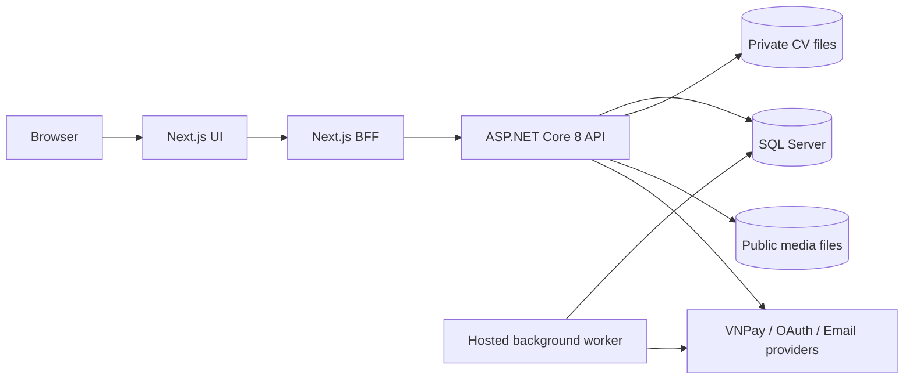

The browser does not call the canonical API directly in the normal frontend path. Next.js server routes act as a BFF: they resolve the backend URL on the server, attach the backend bearer token obtained through NextAuth, forward selected request headers, and propagate response metadata such as `ETag` and `X-Correlation-ID`.

## 2. Runtime Architecture

The ASP.NET Core process composes controllers, middleware, EF Core, business services, and a hosted background worker. `Program.cs` configures the HTTP pipeline and dependency injection. EF Core connects the service layer to SQL Server with retry-on-failure configuration.

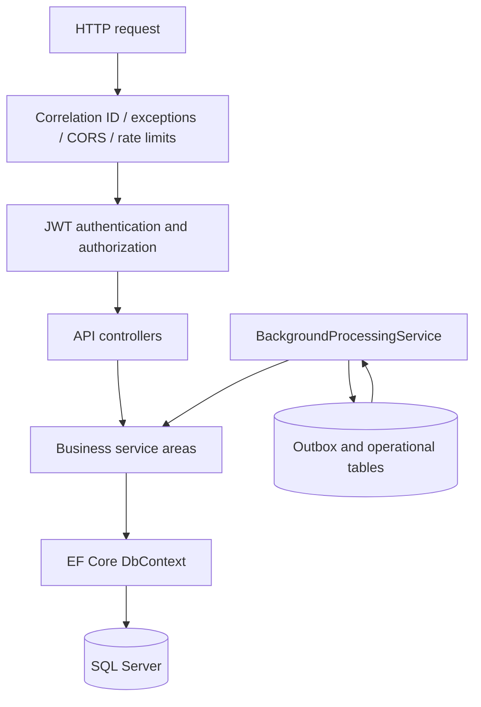

The default authorization fallback policy requires authentication unless an endpoint opts into anonymous access. Rate limiting is configured for authentication and payment paths. A correlation ID is accepted or generated for each request and is logged through the request lifetime.

## 3. Backend Modules

The source uses controllers and service classes rather than a formally named Clean Architecture `Domain` or `Application` project. The following view keeps those actual boundaries explicit:

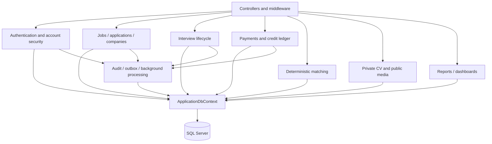

Important service areas include:

- Authentication and user services: registration, login, password lifecycle, OAuth verification, and profile access.
- Recruitment services: job posts, applications, companies, candidate profiles, and workflow history.
- Interview services: scheduling, overlap checks, rescheduling, completion, cancellation, and result-driven application transitions.
- Payment services: payment orders, VNPay IPN processing, plan snapshots, and credit ledger operations.
- Matching services: normalized skill/experience/education/preference scoring and persisted match results.
- Platform services: audit sanitization, durable outbox messages, notifications, email delivery, correlation, and periodic maintenance.

## 4. Database Responsibilities

`ApplicationDbContext` owns the relational model and persistence rules. The database stores, among other entities:

- Users, candidate profiles, skills, certificates, education, experience, preferences, OAuth accounts, and password-reset tokens.
- Companies, job posts, applications, application status history, interviews, saved jobs, and notifications.
- Plans, payment orders, credit ledger entries, audit logs, outbox messages, reports, newsletters, blogs, reviews, and matching results.

Integrity rules include unique email and OAuth identities, one candidate application per job, unique payment references, filtered notification/outbox deduplication indexes, restrictive financial foreign keys, and indexed workflow lookup columns. Job posts, companies, interviews, reports, and relevant application resources use SQL Server `rowversion` values for optimistic concurrency.

The database is also the source of truth for payment status, credit balance derivation, application history, interview state, and outbox delivery state. External email delivery is not part of the SQL transaction.

## 5. Recruitment and Interview Workflows

### Application state machine

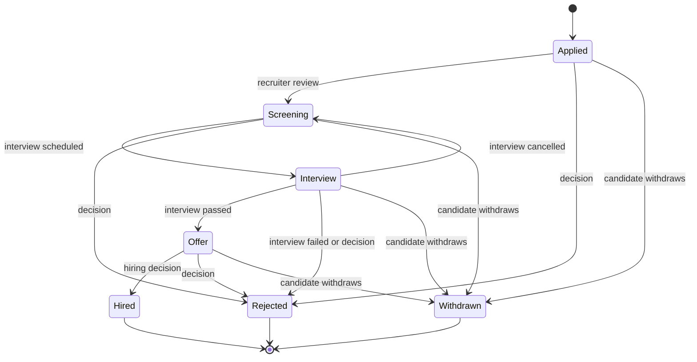

Normal recruiter transitions are validated from the current status. Candidates can withdraw from non-terminal application states. Administrative override is a separate path, requires a reason, and is audited.

### Interview lifecycle

Interviews have type `Online`, `Onsite`, or `Phone`; status `Scheduled`, `Completed`, or `Cancelled`; and result `Pending`, `Passed`, or `Failed`.

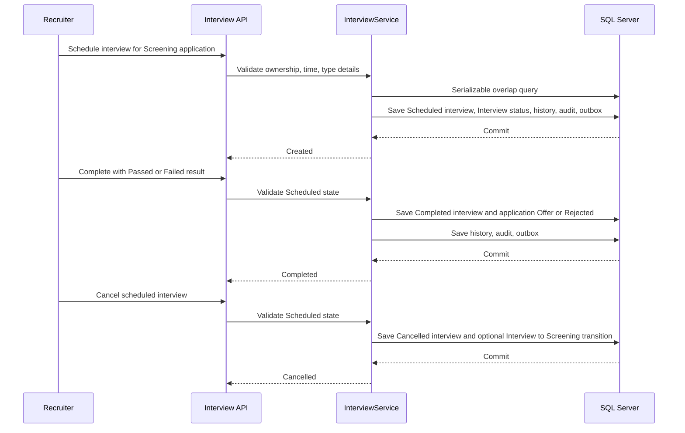

Scheduling and rescheduling use a serializable transaction and reject overlapping scheduled interviews for the same interviewer. Online interviews require an HTTPS meeting URL; onsite interviews require a location; phone interviews require a location or meeting URL.

## 6. Optimistic Concurrency with ETags

Critical updates use the stored `rowversion` as an opaque version token. Controllers return the encoded value in an `ETag` header and require the client to send that value back in `If-Match`.

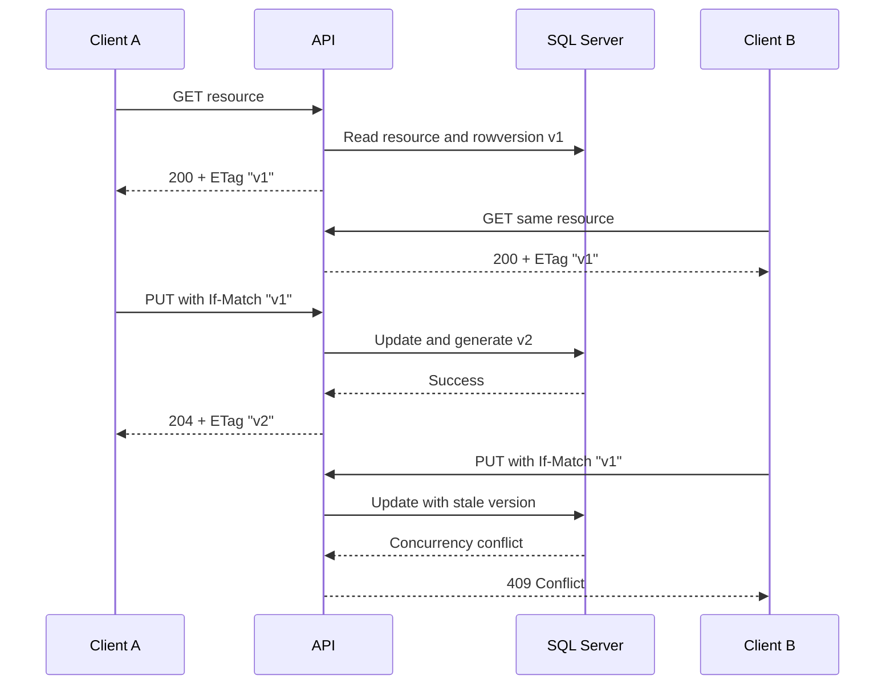

If the precondition is missing, the API returns `428 Precondition Required`. A stale token returns `409 Conflict`. This is implemented for the company and interview flows and is also supported by the relevant job-post, application, and report update paths. The token is opaque; clients should not parse it.

## 7. Transaction Boundaries

An application status change follows this unit-of-work shape:

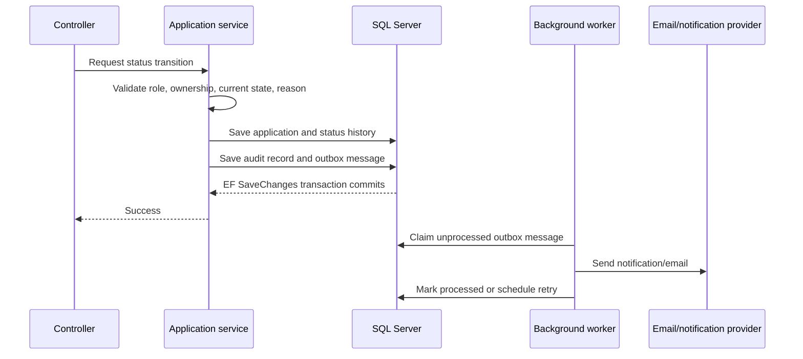

The application service relies on the EF Core `SaveChanges` transaction to commit the application, history, audit, and outbox records together. Job creation plus credit debit, interview mutations, payment confirmation plus entitlement grants, and related coupled operations use explicit serializable transactions where the source requires stronger isolation. There is no distributed transaction across SQL Server, VNPay, OAuth, or email.

## 8. Transactional Outbox and Background Processing

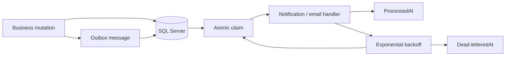

`OutboxMessage` records the message type, serialized payload, occurrence time, attempt count, next-attempt time, last error, optional dead-letter time, deduplication key, and correlation ID. The hosted worker runs when `BackgroundJobs:Enabled` is enabled, claims up to 50 eligible messages, retries failures with capped exponential backoff, and dead-letters messages after ten attempts.

Handlers create deduplicated notifications and can send email. Processing is at-least-once with database deduplication for supported message effects; it is not exactly-once. If a process crashes after an external email is sent but before `ProcessedAt` is saved, a later retry can send the email again.

The same worker also performs periodic maintenance for expired jobs and payment orders, interview reminders, newsletter scheduling, and matching refreshes. These jobs run in the ASP.NET Core process rather than in a separate worker deployment.

## 9. Payment Confirmation

The browser starts payment, but the server-side VNPay IPN determines whether credits are granted.

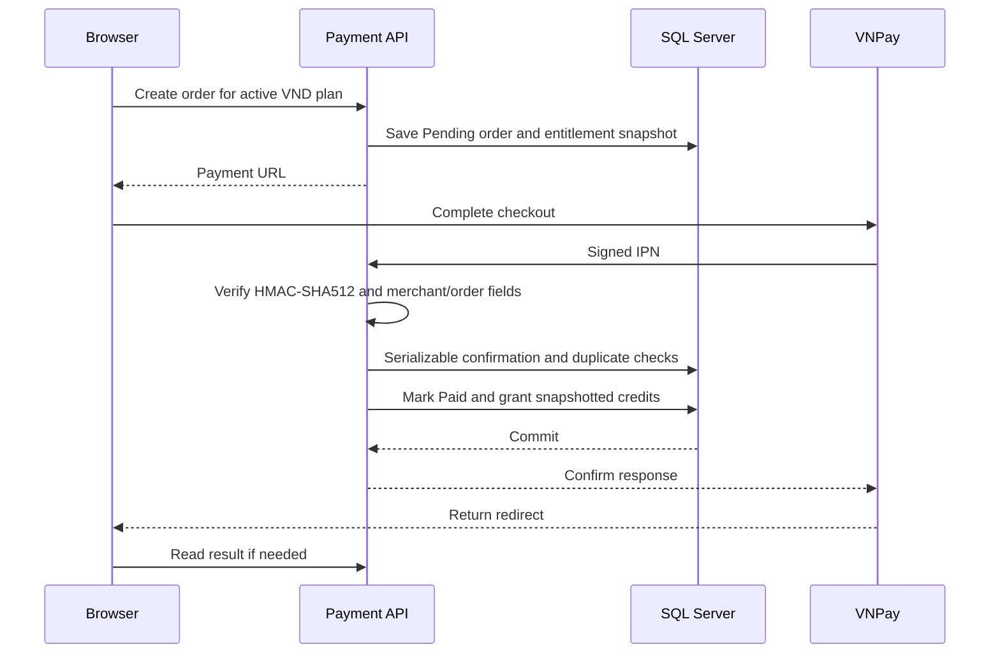

The IPN validates the merchant, VND currency, positive amount, local transaction reference, response/status fields, transaction number, signature, order expiry, and amount against the stored snapshot. A repeated notification with the same transaction is idempotent. A paid order with a different transaction is rejected. The frontend return endpoint is informational and never grants credit by itself.

## 10. Credit Ledger

The credit ledger is append-only from the service perspective. The current entry types are `Grant`, `Debit`, `Refund`, and `Adjustment`.

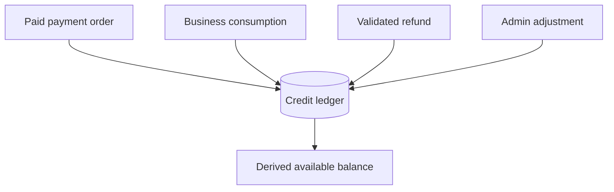

Payment grants use an idempotency key tied to the payment order and credit type. Debits are checked against available balance and retain expiry/source information. Refunds use a source idempotency key, require the original debit and exact refundable quantity, and preserve source/expiry information. Adjustments require a non-zero quantity, actor, reason, and idempotency key; negative balances are rejected and repeated identical requests are safe.

## 11. Private CV Security

Private CV storage is deliberately separate from public media storage.

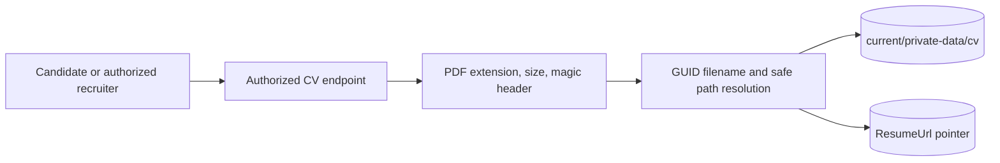

Upload behavior:

1. The API accepts only `.pdf` files up to 5 MB and checks the first five bytes for `%PDF-`.
2. A GUID-based filename is generated. Path resolution rejects traversal and mismatched basenames.
3. The file is written to a temporary `.uploading` path, the profile pointer is saved in a database transaction, and the file is moved to its final private path before commit.
4. Failure cleanup removes temporary/final files where possible; replacement cleanup occurs after a successful commit.

Read access is limited to the candidate, an administrator, or a recruiter who has an application connected to the candidate's job. `/uploads/cv` direct web access is blocked. Public logos and blog images use a separate `wwwroot/uploads` validation path. The implementation does not claim antivirus scanning.

## 12. Authentication and Security Boundaries

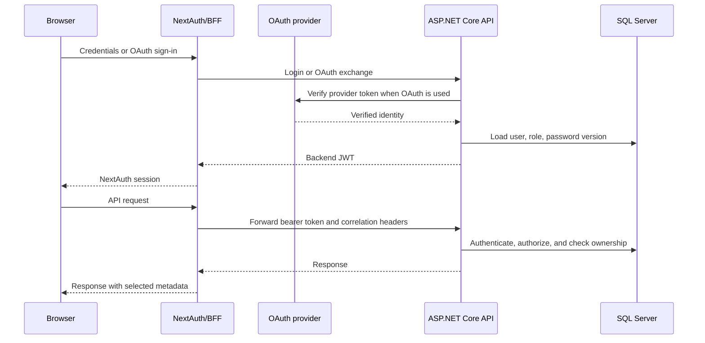

Password authentication uses BCrypt. Failed login attempts can lock an account temporarily. Password changes and resets increment `PasswordVersion`, causing older JWTs to fail validation. Reset tokens are sent in raw form but stored as SHA-256 hashes with expiry and used-state checks. OAuth verification supports Google OpenID user information, Facebook graph data, and a verified primary GitHub email; actual provider credentials remain environment-dependent.

Authorization combines the global authenticated fallback policy with controller-level roles and resource ownership. Authentication and payment endpoints are rate-limited. Audit logging removes or masks sensitive names such as passwords, tokens, secrets, signatures, payment values, CV paths, and storage paths.

## 13. Explainable Matching

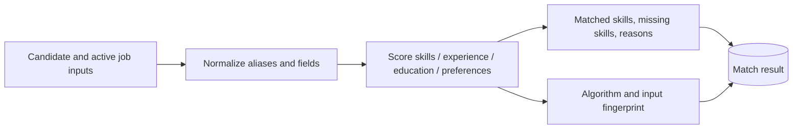

Algorithm version `v1` has the following maximum weights:

| Component | Maximum |
| --- | ---: |
| Required skills | 60 |
| Experience | 20 |
| Education | 10 |
| Preferences | 10 |

The engine normalizes configured aliases, uses certificates as candidate skill evidence, and returns a breakdown rather than an opaque label. A SHA-256 fingerprint covers the algorithm version and relevant candidate/job inputs. Matching is rule-based and is not AI/ML.

Local observations were 196/46/17/16/12/14 ms for seven jobs and 559/271/170/122/117/103 ms for 1,007 jobs, with HTTP 200 responses. These are local samples; the first request includes warm-up effects and no before/after baseline or production SLA was established.

## 14. Trade-offs and Operational Boundaries

- **Single process worker:** simple deployment and shared database access, but multiple replicas require a deliberate ownership strategy.
- **Serializable transactions:** stronger correctness for payment, interviews, and credit/job coupling, with possible contention under load.
- **Private filesystem storage:** simple and explicit for local deployment, but distributed production storage would need additional operational design.
- **Rule-based matching:** explainable and reproducible, but large catalogs may need further indexing or precomputation.
- **BFF dependency:** keeps backend credentials and tokens server-side, while adding a proxy hop and a second runtime configuration.
- **External providers:** VNPay, OAuth, and email remain outside the SQL transaction and need operational retry/monitoring.

The project scope intentionally excludes microservices, Kafka, RabbitMQ, Kubernetes, CQRS, event sourcing, and AI/ML. Those are architectural alternatives, not hidden claims about the current implementation.

## 15. Verification Boundary

The latest local verification pass reported:

- Backend Release build: pass, 0 errors and 176 warnings.
- Backend tests: pass, 10/10.
- EF Core database update: pass, no migrations pending.
- Frontend production build: pass, 87 pages generated.
- Frontend lint: pass with existing warnings.
- Frontend OpenAPI contract check: pass, 39 paths and 38 schemas.
- Docker Compose: configuration statically validated; Docker daemon was unavailable for end-to-end startup, health, and persistence verification.
- OAuth runtime: implementation present, but provider credentials were not available for a complete runtime check.
- GitHub Actions: the latest backend run failed during `dotnet build`; no success badge or green-CI claim is made.

## Source Map

The following source files are the primary implementation references for this document:

| Concern | Source |
| --- | --- |
| Application composition and middleware | [`Program.cs`](../JobPortalApi/Program.cs) |
| EF Core model and constraints | [`ApplicationDbContext.cs`](../JobPortalApi/Data/ApplicationDbContext.cs) |
| Application transitions | [`ApplyService.cs`](../JobPortalApi/Services/User/ApplyService.cs) |
| Interview lifecycle | [`InterviewService.cs`](../JobPortalApi/Services/User/InterviewService.cs) |
| Payment/IPN handling | [`PaymentService.cs`](../JobPortalApi/Services/Payments/PaymentService.cs) |
| Credit ledger | [`CreditLedgerService.cs`](../JobPortalApi/Services/Payments/CreditLedgerService.cs) |
| Outbox processing | [`BackgroundProcessingService.cs`](../JobPortalApi/Services/Infrastructure/BackgroundProcessingService.cs) and [`OutboxService.cs`](../JobPortalApi/Services/Infrastructure/OutboxService.cs) |
| Audit sanitization | [`AuditLogService.cs`](../JobPortalApi/Services/Infrastructure/AuditLogService.cs) |
| Concurrency token | [`ConcurrencyToken.cs`](../JobPortalApi/Services/Infrastructure/ConcurrencyToken.cs) |
| Private CV storage | [`PrivateCvStorage.cs`](../JobPortalApi/Services/Helpers/PrivateCvStorage.cs) |
| CV authorization boundary | [`RecruiterCandidateProfileController.cs`](../JobPortalApi/Controllers/User/RecruiterCandidateProfileController.cs) |
| Matching algorithm | [`MatchingEngine.cs`](../JobPortalApi/Services/Matching/MatchingEngine.cs) |
| Matching persistence/querying | [`MatchingService.cs`](../JobPortalApi/Services/Matching/MatchingService.cs) |
| Frontend BFF | [Next.js backend route](https://github.com/hataba123/jobportal-fe/blob/master/src/app/api/backend/%5B...path%5D/route.ts) |
